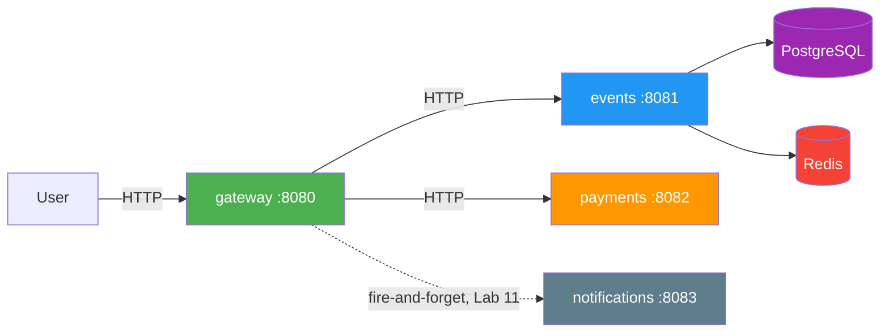
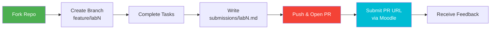

# SRE Intro — Site Reliability Engineering Fundamentals


A hands-on elective course that teaches how to build and operate reliable systems using Site Reliability Engineering practices. You work on a provided microservice application (**QuickTicket**) and progressively add observability, SLOs, CI/CD, GitOps, progressive delivery, chaos experiments, and database resilience — ending with an interview-ready portfolio project.

> *"Hope is not a strategy."* — Google SRE motto

---

## Course Roadmap

The course follows a **build → observe → define → automate → deliver → alert → break → recover → review** progression. Each week builds on the previous.

| Week | Lab | Module | Key Topics & Technologies |
|------|-----|--------|---------------------------|
| 1 | Lab 1 | SRE Philosophy & Systems Thinking | SRE vs DevOps, reliability as a feature, error budgets, toil; Docker Compose; failure exploration |
| 2 | Lab 2 | Containerization | Dockerfiles, image layers, container lifecycle, multi-service Compose |
| 3 | Lab 3 | Monitoring, Observability & SLOs | Prometheus, Grafana, golden signals, SLIs, SLOs, error budgets, recording rules |
| 4 | Lab 4 | Kubernetes | k3d (k3s in Docker), Deployments, Services, probes, resource limits; Helm (bonus) |
| 5 | Lab 5 | CI/CD & GitOps | GitHub Actions, ghcr.io, ArgoCD, GitOps pull model, `git revert` rollback |
| 6 | Lab 6 | Alerting & Incident Response | Grafana Alerting, SLO burn-rate alerts, runbooks, blameless postmortems |
| 7 | Lab 7 | Progressive Delivery | Argo Rollouts, canary with AnalysisTemplate, automated abort, in-cluster Prometheus |
| 8 | Lab 8 | Chaos Engineering & Resilience | Hypothesis-driven experiments, fault injection, partial failure, weakest-link analysis |
| 9 | Lab 9 | Stateful Services & DB Reliability | Alembic migrations, `pg_dump` backup/restore, RTO/RPO, PVC + automated CronJob backups |
| 10 | Lab 10 | SRE Portfolio & Reliability Review | Locust in-cluster load tests, DORA metrics, toil identification, capstone review |
| — | Lab 11 | Advanced Microservice Patterns *(bonus)* | Adds a 4th service; retries with backoff, circuit breaker, rate limiter |
| — | Lab 12 | Advanced K8s Resilience *(bonus)* | PodDisruptionBudgets, graceful shutdown (preStop), zero-downtime `CREATE INDEX CONCURRENTLY` |

---

## The Project: QuickTicket

A 3-service ticket reservation system. **You don't build the app; you make it reliable.** (Lab 11 adds a 4th service as an exercise in the bonus track.)



| Service | Role | State | Language |
|---------|------|-------|----------|
| **gateway** | API router, timeouts, Lab 11 resilience patterns | Stateless | Python 3.13 / FastAPI |
| **events** | Tickets, reservations, orders | PostgreSQL + Redis | Python 3.13 / FastAPI |
| **payments** | Mock payment processor, tunable failures | Stateless | Python 3.13 / FastAPI |
| **notifications** | Mock notifier (Lab 11) | Stateless | Python 3.13 / FastAPI |

All services expose Prometheus metrics (`*_requests_total`, `*_request_duration_seconds`) and emit structured JSON logs.

**Built-in fault injection** via environment variables — no extra tools needed for chaos:

| Variable | Service | Effect |
|----------|---------|--------|
| `PAYMENT_FAILURE_RATE=0.3` | payments | 30% of charges return 500 |
| `PAYMENT_LATENCY_MS=2000` | payments | Every charge takes 2s+ |
| `NOTIFY_FAILURE_RATE=0.5` | notifications *(Lab 11)* | Half of notifies return 500 |
| `NOTIFY_LATENCY_MS=300` | notifications *(Lab 11)* | Injected notify latency |
| `DB_MAX_CONNS=3` | events | Tiny connection pool, exhausts under load |
| `GATEWAY_TIMEOUT_MS=3000` | gateway | Gateway gives up after 3s |

---

## Lectures

Each lecture is 17-25 slides, 340-520 lines of Markdown. Readings 11-12 are self-study (no slide format, pure prose: 400-500 lines each).

| # | Title | Slides | File |
|--:|-------|-------:|------|
| 1 | SRE Philosophy: From Hope to Engineering | 23 | [lec1.md](lectures/lec1.md) |
| 2 | Containerization: Packaging for Reliability | 22 | [lec2.md](lectures/lec2.md) |
| 3 | Monitoring, Observability & SLOs | 22 | [lec3.md](lectures/lec3.md) |
| 4 | Kubernetes & Helm: From Compose to a Cluster | 16 | [lec4.md](lectures/lec4.md) |
| 5 | CI/CD & GitOps: Automating the Path to Production | 22 | [lec5.md](lectures/lec5.md) |
| 6 | Alerting & Incident Response | 20 | [lec6.md](lectures/lec6.md) |
| 7 | Progressive Delivery: Canary Deployments | 18 | [lec7.md](lectures/lec7.md) |
| 8 | Chaos Engineering: Break Things on Purpose | 18 | [lec8.md](lectures/lec8.md) |
| 9 | Stateful Services & DB Reliability | 20 | [lec9.md](lectures/lec9.md) |
| 10 | SRE Portfolio: Pulling It All Together | 19 | [lec10.md](lectures/lec10.md) |
| R11 | Reading — Advanced Microservice Patterns | 473 | [reading11.md](lectures/reading11.md) |
| R12 | Reading — Advanced Kubernetes Resilience | 408 | [reading12.md](lectures/reading12.md) |

---

## Technology Stack

All tools are **free and open-source** (or have a free tier). Versions are pinned to the latest stable as of April 2026.

| Category | Tool | Version | Introduced |
|----------|------|---------|------------|
| Application runtime | Python + FastAPI + uvicorn | 3.13 / 0.136 / 0.44 | Week 1 (provided) |
| Containers | Docker + Compose | Docker 28.x | Week 1 |
| Database | PostgreSQL | 17-alpine | Week 1 (provided) |
| Cache / KV | Redis | 7-alpine | Week 1 (provided) |
| Metrics | Prometheus | v3.11.2 | Week 3 (docker-compose); Week 7 (in-cluster) |
| Dashboards | Grafana | 13.0.1 | Week 3 |
| Kubernetes | k3d (k3s in Docker) | v1.33 | Week 4 |
| Packaging *(optional)* | Helm 3 | — | Week 4 (bonus only) |
| CI/CD | GitHub Actions + ghcr.io | — | Week 5 |
| GitOps | ArgoCD | v3.3.x | Week 5 |
| Alerting | Grafana Alerting | — | Week 6 |
| Progressive Delivery | Argo Rollouts | v1.9.x | Week 7 |
| DB Migrations | Alembic | 1.18 | Week 9 |
| Load Testing | Locust | 2.43 | Week 10 |

**Kubernetes is introduced in Week 4 and used for every subsequent lab** — labs do not ship docker-compose-based alternatives after that point.

> 📡 **On "observability stack" scope:** the course uses Prometheus + Grafana only. Tempo/Loki are *mentioned* in lectures as adjacent tooling you'd add in a production stack, but aren't deployed. Services expose plain Prometheus metrics (no OpenTelemetry SDK).

---

## What Ships vs What Students Produce

The course repo ships **only** lab specs, lecture notes, and the application. Students generate the infra layer per lab in their own fork:

| Path | Ships in repo | Students produce |
|------|:-------------:|:----------------:|
| `app/` (gateway, events, payments, seed.sql, loadgen/) | ✅ | |
| `lectures/` | ✅ | |
| `labs/labN.md` | ✅ | |
| `labs/labN/*.yaml`, `labs/lab10/locustfile.py` — *plumbing* for labs that needs a file | ✅ | |
| `monitoring/grafana/` (provisioning + golden-signals dashboard skeleton) | ✅ | |
| `monitoring/prometheus/prometheus.yml` — *students write in Lab 3* | | ✅ |
| `k8s/*.yaml` — *students write in Lab 4, evolve through Lab 12* | | ✅ |
| `.github/workflows/ci.yml` — *students add in Lab 5* | | ✅ |
| `migrations/` + `alembic.ini` — *`alembic init` in Lab 9* | | ✅ |
| `app/notifications/` — *students add in Lab 11 (bonus)* | | ✅ |
| `locustfile.py` at repo root — *copied from `labs/lab10/` in Lab 10* | | ✅ |
| `submissions/` — *lab reports, one per week* | | ✅ |

The [`.gitignore`](.gitignore) enforces the split so student artifacts don't accidentally get pushed to the course repo.

**Provided lab-asset files** (plumbing — not the lab's learning objective):

| File | Purpose | Used in |
|------|---------|---------|
| [`labs/lab7/prometheus.yaml`](labs/lab7/prometheus.yaml) | In-cluster Prometheus with pod-SD + `rollouts-pod-template-hash → rs_hash` relabel | Lab 7 Bonus, 8, 10, 12 |
| [`labs/lab7/analysis-template.yaml`](labs/lab7/analysis-template.yaml) | AnalysisTemplate with `initialDelay` + safe numerator fallback for canary error-rate | Lab 7 Bonus |
| [`labs/lab7/loadgen.yaml`](labs/lab7/loadgen.yaml) | In-cluster curl loop hitting `/events` + `/health` | Lab 7 |
| [`labs/lab8/mixedload.yaml`](labs/lab8/mixedload.yaml) | In-cluster curl loop hitting the full checkout chain | Labs 8, 9, 10, 11, 12 |
| [`labs/lab9/backup-storage.yaml`](labs/lab9/backup-storage.yaml) | PVC + `backup-inspector` Deployment for DB backups | Lab 9 Bonus |
| [`labs/lab10/locustfile.py`](labs/lab10/locustfile.py) | Locust scenario (list/reserve/health mix, spread across events 3+5) | Lab 10 |
| [`labs/lab10/locust-runner.yaml`](labs/lab10/locust-runner.yaml) | Job template for running Locust in-cluster | Lab 10 |

---

## Lab Structure

Each lab in weeks 1-10 caps at **12 pts = 10 main + 2 bonus**.

| Task | Points | Description | Required? |
|------|-------:|-------------|-----------|
| **Task 1** | 6 pts | Core step that advances the project. Future labs depend on it. | Yes |
| **Task 2** | 4 pts (3 in Lab 1) | Deeper dive into the week's topic. Skippable — won't affect future labs. | No |
| **Task 3** | 1 pt | *Lab 1 only* — GitHub community engagement. | Lab 1 |
| **Bonus Task** | 2 pts | Extension for motivated students (flat 2 pts each, no difficulty weighting). | No |

A student who only completes **Task 1 across all 10 labs** still ends up with a fully working SRE portfolio project.

**Bonus labs (11 + 12)** have a tighter shape: **Task 1 (4 pts) + Task 2 (4 pts) + Bonus Task (2 pts) = 10 pts total** (vs main labs' 12). The labs are bonus-track in the sense that they're not on the critical path; the Bonus Task inside each lab is still the genuinely-challenging extension. Bonus labs count toward a separate 20% weight (see grading below).

### Submission Workflow



Submissions are **CLI output + brief analysis**, not source code. Paste the commands you ran and what they printed; answer the questions at the end of each task in 2-3 sentences.

---

## Grading

The final grade is composed from five components. Their max contributions add up to **139%** but the grade is **capped at 100%** — meaning multiple paths to A exist, no single path is required, and no point ever goes to waste.

| Component | Raw Points | Weight | What it rewards |
|-----------|-----------:|-------:|-----------------|
| **Main labs 1-10** (Task 1 + Task 2 + Task 3-where-applicable) | 100 | **70%** | Diligent project work — the floor for any serious student |
| **Bonus tasks 1-10** (2 pts each, flat — no difficulty weighting) | 20 | **14%** | Going above and beyond on weekly topics |
| **Quiz leaderboards** (5 rolling per-2-labs leaderboards, top-10 share 1% pool each) | — | **up to 5%** | Engagement + excellence; rewards late-joining students too |
| **Bonus labs 11 + 12** (Task 1 + Task 2 + Bonus = 10 pts each) | 20 | **20%** | Mastering advanced microservice + K8s resilience patterns |
| **Final exam** | — | **30%** | Optional path — written, comprehensive |
| **Sum (capped at 100%)** | | **139%** | |

### What this produces in practice

Two real paths to A (≥90%):

- **Practice path:** all main labs + bonuses + at least one bonus lab → ≥90%. No exam required.
- **Exam path:** all main labs + bonuses + decent exam → ≥90%. No bonus labs required.
- Doing **both** caps at 100% with a comfortable buffer for missed points elsewhere.

Sample scores:

| Profile | Main | L-bonus | Bonus labs | Exam | Quiz | Total |
|---------|-----:|--------:|-----------:|-----:|-----:|------:|
| All Task 1 only, nothing else | 42% | 0% | 0% | 0% | 0% | **42%** |
| All Task 1+2, no bonuses, no exam | 70% | 0% | 0% | 0% | 0% | **70%** |
| Add all weekly bonuses | 70% | 14% | 0% | 0% | 0% | **84%** |
| + good quiz | 70% | 14% | 0% | 0% | 5% | **89%** ← *just short of A* |
| + finish one bonus lab | 70% | 14% | 10% | 0% | 5% | **99%** ← *A territory* |
| + both bonus labs | 70% | 14% | 20% | 0% | 5% | **100%** (capped) |
| Or take the exam instead | 70% | 14% | 0% | 25% | 5% | **100%** (capped) |
| Coast (Task 1 only + lucky quiz)  | 42% | 0% | 0% | 0% | 5% | **47%** |

**The deliberate design:** `Main + lab-bonuses + quiz` alone tops out at **89% → just short of A**. To earn A you must do at least one bonus lab OR the exam. That stops the "easy A from quiz padding" pattern.

### Quiz leaderboards (the 5%)

Five rolling windows, one per pair of labs:

| Window | Labs covered |
|--------|--------------|
| 1 | labs 1-2 |
| 2 | labs 3-4 |
| 3 | labs 5-6 |
| 4 | labs 7-8 |
| 5 | labs 9-10 |

Each window allocates a **1% pool** to its top 10 students. Rough split: #1 = 0.30%, #2 = 0.20%, #3-5 = 0.10% each, #6-10 = 0.04% each. Maxing all 5 leaderboards at #1 = 1.5% — practically capped around 1-2% for top performers, who are unlikely to win every window. Late-joining students can still rank in later windows without being structurally disadvantaged.

### Performance tiers

| Grade | Range | Required to reach |
|-------|-------|-------------------|
| **A** | 90-100 | All main labs + at least one of: bonus labs / exam (multiple paths) |
| **B** | 75-89 | Main labs + most bonuses, no extension work |
| **C** | 60-74 | Main lab Task 1 across most labs |
| **D** | 0-59 | Below expectations |

### Late submissions

Max 6/12 per lab if submitted within 1 week of deadline. No credit after 1 week.

---

## Required Software

<details>
<summary>Core (all weeks)</summary>

- Git, Docker, Docker Compose
- A terminal (bash/zsh)
- Text editor with Markdown support

</details>

<details>
<summary>Per-week additions</summary>

| Week | Add |
|------|-----|
| 4 | `k3d`, `kubectl` (client v1.33 to match the k3s server) |
| 4 *(bonus)* | `helm` |
| 5 | GitHub account (free), a classic PAT with `read:packages` for `ghcr.io` |
| 7 | `kubectl argo rollouts` plugin (install to `~/.local/bin`, no `sudo` needed) |
| 9 | Python 3.13 + pip for running Alembic on the host (connects via `kubectl port-forward svc/postgres 5432:5432`) |
| 10 | Locust (`pip install locust==2.43.4`) — optional, since the lab runs Locust in-cluster |

</details>

---

## Repository Structure

```
SRE-Intro/
├── README.md                 # This file
├── .gitignore                # Keeps student artifacts out of the course repo
│
├── app/                      # QuickTicket source (ships)
│   ├── gateway/              #   API router
│   ├── events/               #   Tickets / reservations
│   ├── payments/             #   Mock payment processor
│   ├── docker-compose.yaml   #   Compose stack for Labs 1-3
│   ├── seed.sql              #   Initial events rows
│   └── loadgen/              #   Bash load generator (Labs 1-3)
│
├── docker-compose.monitoring.yaml   # Prometheus + Grafana for Lab 3 (ships)
│
├── monitoring/
│   ├── grafana/              # Golden-signals dashboard skeleton + provisioning (ships)
│   └── prometheus/           # (students write prometheus.yml in Lab 3)
│
├── lectures/                 # 10 lectures + 2 bonus readings (ships)
│   ├── lec1.md ... lec10.md
│   └── reading11.md, reading12.md
│
├── labs/                     # Lab specs (ship)
│   ├── lab1.md ... lab12.md
│   ├── lab7/                 # Provided assets for Lab 7 (prometheus, analysis-template, loadgen)
│   ├── lab8/                 # mixedload.yaml
│   ├── lab9/                 # backup-storage.yaml
│   └── lab10/                # locustfile.py, locust-runner.yaml
│
│── k8s/                      # (students write from Lab 4 onward)
│── .github/workflows/        # (students add in Lab 5)
│── migrations/               # (students init via Alembic in Lab 9)
│── locustfile.py             # (students copy from labs/lab10/ in Lab 10)
└── submissions/              # (students write one report per lab)
```

---

## Key Books & Resources

| Book | Author(s) | Why |
|------|-----------|-----|
| **Site Reliability Engineering** | Beyer, Jones, Petoff, Murphy (Google, 2016) | The original SRE book. Free at [sre.google](https://sre.google/sre-book/table-of-contents/) |
| **The Site Reliability Workbook** | Google (2018) | Practical companion with exercises. Free at [sre.google](https://sre.google/workbook/table-of-contents/) |
| **Implementing Service Level Objectives** | Alex Hidalgo (O'Reilly, 2020) | The definitive guide to SLIs, SLOs, and error budgets |
| **Accelerate** | Forsgren, Humble, Kim (IT Revolution, 2018) | DORA metrics — what predicts high-performing engineering teams |
| **Chaos Engineering** | Rosenthal & Jones (O'Reilly, 2020) | Principles of controlled failure injection |
| **Release It!** | Michael Nygard (2nd ed., 2018) | Stability patterns — circuit breaker, bulkhead, timeouts |
| **Database Reliability Engineering** | Campbell & Majors (O'Reilly, 2017) | The DBRE bible |

<details>
<summary>Official documentation</summary>

- [Prometheus](https://prometheus.io/docs/) / [Grafana](https://grafana.com/docs/)
- [Kubernetes](https://kubernetes.io/docs/concepts/) / [k3d](https://k3d.io/)
- [ArgoCD](https://argo-cd.readthedocs.io/) / [Argo Rollouts](https://argoproj.github.io/argo-rollouts/)
- [Alembic](https://alembic.sqlalchemy.org/) / [PostgreSQL](https://www.postgresql.org/docs/)
- [Locust](https://docs.locust.io/)

</details>

<details>
<summary>Incident / postmortem</summary>

- [PagerDuty Incident Response Guide](https://response.pagerduty.com/)
- [Dan Luu — Public Postmortem Collection](https://github.com/danluu/post-mortems)
- [Kubernetes Failure Stories](https://k8s.af/)

</details>

---

## Course Completion

By Week 10 you'll have:

- A working QuickTicket deployment on k3d with 5 replicas of the gateway, Postgres on a PVC, ArgoCD-driven GitOps, Argo Rollouts canary with automated analysis, in-cluster Prometheus, and an SLO-based alerting config.
- Lab reports documenting: failure exploration, SLO definition, CI/CD setup, an incident response with postmortem, 3 chaos experiments, a backup/restore cycle with measured RTO/RPO, Locust load tests identifying the system's breaking point, and a capstone reliability review.
- If you did the bonus labs: a 4th microservice with in-code retries + circuit breaker + rate limiter, and a production-grade K8s resilience story (PDBs, graceful shutdown, zero-downtime migrations).

**This is exactly the portfolio you'd walk through in an SRE interview** — see the 5-minute walkthrough script in `submissions/lab10.md` (produced in Lab 10 capstone).
