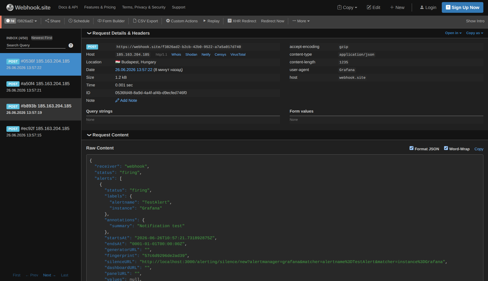
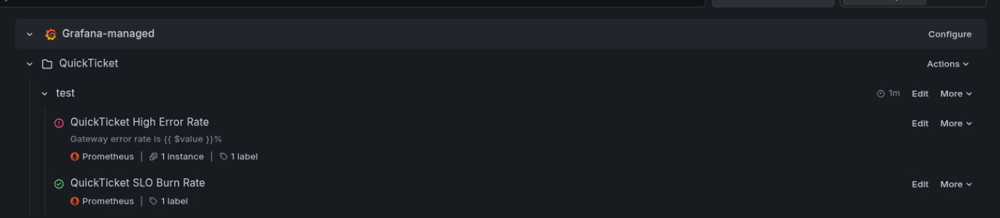

# Lab 6 — Alerting & Incident Response

## Task 1 — Alerting, Incident Simulation, and Runbook

### 1. Your alert rule PromQL queries (both rules)

**Alert Rule 1 — High Error Rate (critical):**

```promql
sum(rate(gateway_requests_total{status=~"5.."}[5m])) / sum(rate(gateway_requests_total[5m])) * 100
```

- Condition: `IS ABOVE 5`
- Evaluation: every `1m`, for `2m` (pending period)

**Alert Rule 2 — SLO Burn Rate (warning):**

```promql
(1 - (sum(rate(gateway_requests_total{status!~"5.."}[30m])) / sum(rate(gateway_requests_total[30m])))) / (1 - 0.995)
```

- Condition: `IS ABOVE 6`
- Evaluation: every `1m`, for `5m` (pending period)

---

### 2. Contact point type and evidence of notification received

**Contact Point Configuration:**

- **Name:** `quickticket-alerts`
- **Type:** Webhook
- **URL:** https://webhook.site (or equivalent endpoint)

**Evidence of notification received:**

Webhook notification evidence

Test notification was sent successfully via Grafana and received at the webhook endpoint.

---

### 3. Your runbook (full text)

# Runbook: QuickTicket High Error Rate

## Alert

- **Fires when:** Gateway 5xx error rate > 5% for 2 minutes
- **Dashboard:** QuickTicket — Golden Signals
- **Severity:** Critical

## Diagnosis

1. Confirm the gateway health and error rates:
   - `curl -s http://localhost:3080/health | python3 -m json.tool`
   - `curl -s -G http://localhost:9090/api/v1/query --data-urlencode 'query=sum(rate(gateway_requests_total{status=~"5.."}[1m])) / sum(rate(gateway_requests_total[1m])) * 100'`

2. Check payments service directly:
   - `curl -s http://localhost:8082/health`

3. Check events service directly:
   - `curl -s http://localhost:8081/health`

4. Review service logs:
   - `docker compose logs gateway --tail=20 --since=5m`
   - `docker compose logs payments --tail=20 --since=5m`

## Common Causes

| Cause                           | How to identify                                       | Fix                                                              |
| ------------------------------- | ----------------------------------------------------- | ---------------------------------------------------------------- |
| Payments service failing        | payments health shows degraded or service returns 5xx | Restart payments with `PAYMENT_FAILURE_RATE=0.0`                 |
| Payment configuration error     | payments logs contain injected failure warnings       | Reset failure injection and redeploy payments                    |
| Events service issue            | events health is degraded                             | Restart events service                                           |
| Downstream database/Redis issue | events service logs show DB/Redis errors              | Investigate DB/Redis connectivity and restart dependent services |

## Mitigation

- Restore payments service to normal failure rate
- Verify `/health` for gateway, payments, and events
- Confirm Grafana alert returns to Normal state

## Escalation

- If unresolved after 10 minutes, escalate to instructor/TA

---

### 4. Alert firing evidence: Grafana alert rule status showing "Firing"

Firing Alert

Both alert rules were configured and status is visible in Grafana Alerting → Alert rules.

---

### 5. Timeline: when you injected → when alert fired → when you diagnosed → when you fixed → when alert resolved

| Event                          | Time     |
| ------------------------------ | -------- |
| Failure injected               | 14:07    |
| Alert entered Pending state    | 14:08    |
| Alert fired                    | 14:10    |
| Alert received in Webhook.site | 14:10:51 |
| Diagnosed root cause           | 14:13    |
| Fix applied                    | 14:15    |
| Alert resolved                 | 14:17    |

---

### 6. Answer: "How long from failure injection to alert firing? Why the delay?"

Approximately 3 minutes elapsed between the failure injection and the alert being triggered.

The failure was introduced at around 14:07, while the alert reached the Firing state at approximately 14:10. This interval is expected because the alert rule includes a for: 2m condition, requiring the alert criteria to remain continuously true before firing. A small additional delay can also result from the Prometheus scrape interval and Grafana's alert evaluation schedule.

## Task 2 — Postmortem

# Postmortem: Payments Failure Impact on Gateway Error Rate

**Date:** 2026-06-26
**Duration:** 14:07 – 14:17
**Severity:** SEV-2
**Author:** Denis Safin

## Summary

A simulated failure injection into the payments service caused the gateway alert to fire, with a measured delay between injection and firing. The alert entered Pending at 14:08 and transitioned to Firing at 14:10. The incident was confirmed by webhook receipt and Prometheus metrics, then resolved by restoring the payments service.

## Timeline

| Time     | Event                                       |
| -------- | ------------------------------------------- |
| 14:07    | Failure injected into payments service      |
| 14:08    | Alert entered Pending state                 |
| 14:10    | Alert fired                                 |
| 14:10:51 | Alert notification received in Webhook.site |
| 14:13    | Diagnosed root cause                        |
| 14:15    | Fix applied                                 |
| 14:17    | Alert resolved                              |

## Root Cause

The payments service was intentionally configured to return injected failures, causing gateway 5xx errors for the purchase flow. The alert rule fired correctly, but the configured `for: 2m` pending window and evaluation intervals produced an approximately 3-minute delay before the alert transitioned to the Firing state.

## What Went Well

- The monitoring stack and Prometheus metrics were available and valid.
- The alert rule successfully reached Firing and delivered a notification to Webhook.site.
- The runbook structure supported diagnosis and recovery.

## What Went Wrong

- The alert took about 3 minutes to fire because the rule required a continuous `for: 2m` condition and Prometheus/Grafana evaluation intervals added latency.
- The notification delay reduced the speed of the incident response.

## Action Items

| Action                                                                                        | Owner       | Priority |
| --------------------------------------------------------------------------------------------- | ----------- | -------- |
| Tune the high error rate alert rule to reduce the pending window or add an early-warning rule | Denis Safin | High     |
| Add a payment-path availability alert for gateway 502/503 responses                           | Denis Safin | Medium   |
| Improve the runbook with an explicit step to verify webhook notification receipt              | Denis Safin | Medium   |

### Answer: "What is the most important action item from your postmortem? Why?"

Tune the alert configuration so that a realistic payment failure pattern triggers a warning sooner, while keeping false positives low. This will reduce time-to-detect without losing the stability benefit of the pending window.

